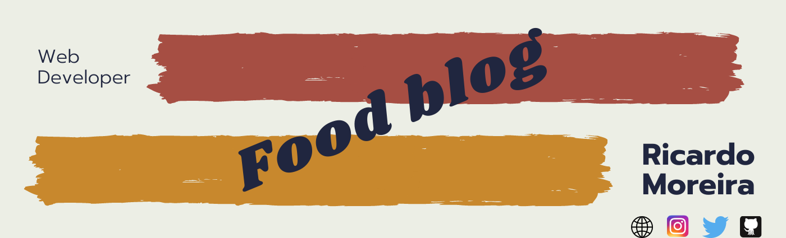
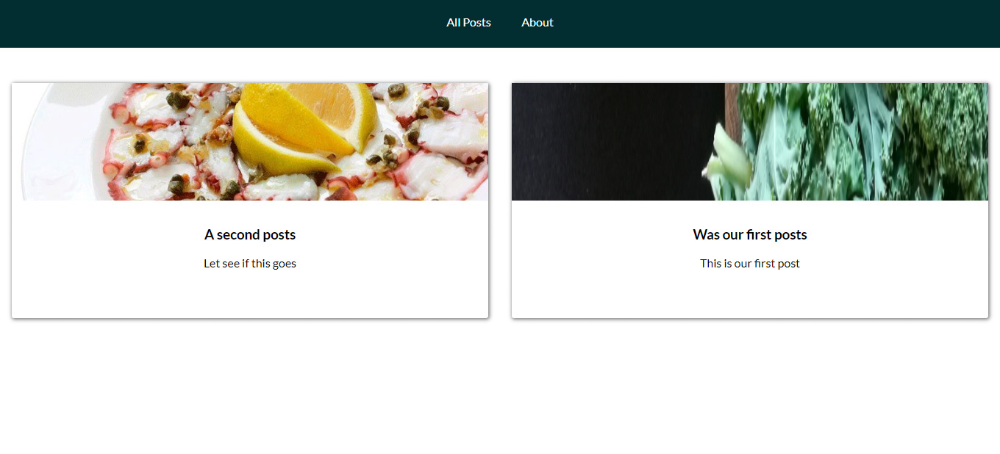
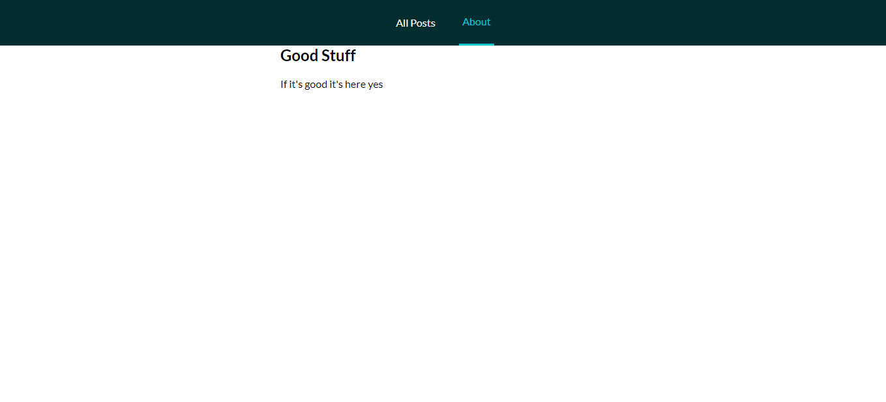

<h1 align="center"> 🔥Food Blog🔥</h1>

<h2 align="center"> A blog about food with Nuxt and storyblok </h2>

### Index

* [Name](#Name) 👈
* [Links](#Links) 🔗
* [Description](#Description) 📖
* [Languages and Frameworks](####Languages-and-Frameworks) ⚙️
* [Screenshots](#Screenshots) 📱
* [Instalation](#Instalation) 🧩
* [Support](#Support) 🆘
* [Roadmap](#Roadmap) 🗺️
* [Authors and acknowledgment](####Authors-and-acknowledgment) ✍️
* [Project Status](#Project-Status) 📜

# Name

Food Blog

# Links

[Website](https://mystifying-kare-43176f.netlify.app/)

___

# Description

After I saw the tutorial to create a blog with [Nuxt](https://nuxtjs.org/) and [Storyblok](https://www.storyblok.com/) I decided to make a blog for food based on this tutorials

___

# Languages, Frameworks and others

* **Nuxt.js** - Framework
* **Storyblok** - Headless CMS
* **Font Awesome** - Icons

____

# Screenshots

Home Page         |  About Page
:-------------------------:|:-------------------------:
  |  

____

# Instalation

___

# Support

Have any question or find something that doesn't look good? Let's talk 😊

[Here](https://github.com/mugas)

[And Here](https://www.ricardomoreira.io/about)

____

# Roadmap

For now the page is done. Is it tough a feature for a bigger project in the future

____

# Authors-and-acknowledgment

* [Based on this](https://www.youtube.com/watch?v=Dc_5BpIB4X4)

* Me 😊

____

# Project-Status  

Done.

____
